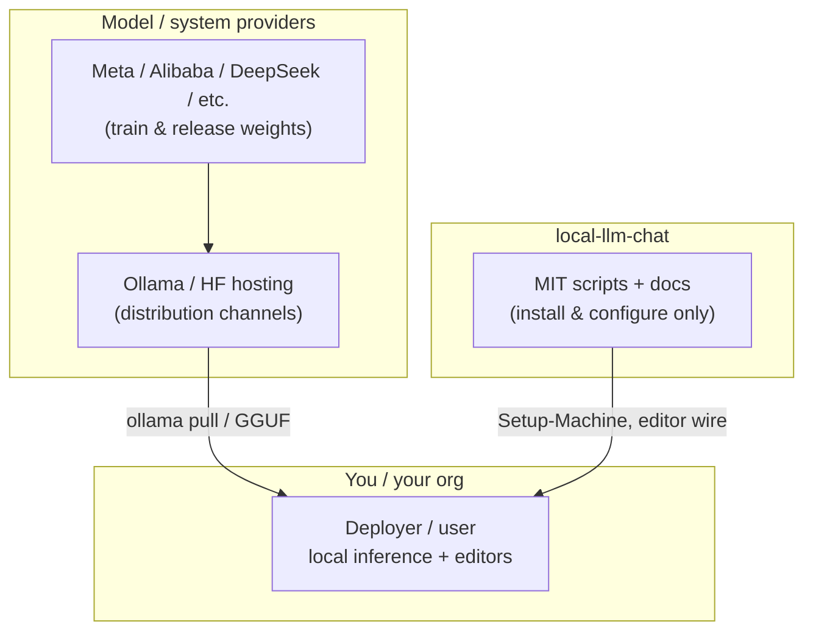

# AI legal & compliance notes (UK / US / EU)

> **Disclaimer:** This is **not legal advice** and does not create an attorney–client relationship. It summarises publicly discussed rules as they relate to **local-llm-chat** (a Windows toolkit for local Ollama + editor wiring). Laws and guidance evolve. Verify with counsel for your facts and jurisdiction.

**Companion summary:** [LEGAL.md](../LEGAL.md) at the repo root.

---

## 1. Bottom line for *this* project

| Question | Practical answer |
|----------|------------------|
| Does cloning/using **local-llm-chat** itself violate UK/US/EU AI statutes? | **No known general prohibition.** The repo is MIT-licensed tooling; it does not place a GPAI model on the market. |
| Is local Ollama coding assistance “banned”? | **No.** Local inference for software development is a common, lawful pattern when model terms and data laws are respected. |
| Where does risk actually sit? | **Your use-case:** model licences, personal/confidential data in prompts, high-risk decision-making, commercial redistribution, sector regulation, employer policy. |

This document maps **roles**, **regions**, and **operator duties**. It does **not** certify compliance.

---

## 2. Roles under modern AI rules (why it matters)

- **GPAI / foundation model *providers*** (who train and release models) carry the heavy **EU AI Act** documentation / copyright-policy duties for general-purpose models.
- **This repository’s authors** ship **scripts and documentation**, not model weights. The MIT [LICENSE](../LICENSE) covers **this code**, not Qwen/Llama/etc.
- **You** are typically a **user** or **deployer** of an AI system (editors + local model). Your duties scale with **context** (personal hobby vs employer processing EU personal data vs credit/HR decisions).

---

## 3. European Union

### 3.1 EU AI Act (Regulation (EU) 2024/1689)

Risk-based framework. Relevant themes for this toolkit:

| Theme | Relevance to local-llm-chat users |
|-------|-----------------------------------|
| **Prohibited AI** (e.g. social scoring, certain biometric categorisation) | Ordinary **coding assistants** are not these practices. Do not repurpose the stack for prohibited uses. |
| **High-risk AI** (Annex III: employment, credit, education scoring, etc.) | Using a local LLM to **decide** hiring/firing, credit, exams, etc. can trigger **deployer** obligations. Using it to **autocomplete code** generally does **not**. |
| **GPAI model providers** (Arts. 53 / 55) | Aimed mainly at organisations that **place models on the market**. Downloading an Ollama tag for personal/internal coding does **not** make you that provider. Fine-tuning and **redistributing** a model may. |
| **Open-source GPAI carve-outs** | Help **upstream** open-weight publishers with some documentation duties; they do **not** erase **your** deployer duties if you build a **high-risk system**. |
| **Transparency** (e.g. users know they interact with AI) | Often low friction for internal IDE tools; still consider labelling if you expose AI chat to external customers. |

**Practical EU takeaway:** Internal developer use of local coding models is usually **limited-risk / not high-risk**. Escalate legal review if you productise the assistant, process special-category data, or automate Annex III decisions.

Official entry points:

- [EU AI Act overview](https://digital-strategy.ec.europa.eu/en/policies/regulatory-framework-ai)
- [GPAI models Q&A](https://digital-strategy.ec.europa.eu/en/faqs/general-purpose-ai-models-ai-act-questions-answers)

### 3.2 GDPR (and ePrivacy where relevant)

Local inference **helps** confidentiality (prompts need not leave the machine), but:

- If prompts or agent tools process **personal data**, GDPR principles still apply (lawful basis, minimisation, security, DPIA when high risk).
- **Cloud** editors/models reintroduce international transfer and processor issues—this repo’s `Disable-RemoteAIProviders.ps1` and `-AirGap` reduce that **technically**, not automatically legally.
- Employee monitoring / logging of AI use may need transparency under employment + data-protection rules.

### 3.3 Copyright / database rights (EU)

- **Training-data lawsuits** target **model trainers**, not typical end users running inference.
- **Your outputs** can still infringe if they reproduce protected code/docs. Treat model suggestions like Stack Overflow snippets: review before shipping.
- Text-and-data-mining exceptions (DSM Directive) are about **training corpora**, not a blank cheque for copying third-party code into products.

---

## 4. United Kingdom

- The UK **does not** (as of early 2026) have a single EU-style AI Act covering all AI. Policy remains **sector / regulator-led** and generally **pro-innovation**, with possible future rules aimed at the most powerful frontier providers ([Commons Library briefing](https://commonslibrary.parliament.uk/research-briefings/cbp-10003/)).
- **UK GDPR** and the **Data Protection Act 2018** still apply to personal data in prompts, logs, and telemetry.
- **ICO** publishes AI and data-protection guidance for organisations: [ICO AI resources](https://ico.org.uk/for-organisations/uk-gdpr-guidance-and-resources/artificial-intelligence/).
- Sector regulators (FCA, Ofcom, MHRA, etc.) may constrain AI in their domains even if “coding on a laptop” is fine.
- **Intellectual property:** UK copyright still protects source code and documentation you do not own; licence compliance for models and dependencies remains contractual + IP law.

**Practical UK takeaway:** No blanket ban on local coding LLMs. Organisations should still inventory AI tools, protect personal data, and follow sector guidance.

---

## 5. United States

- **No comprehensive federal statute** that prohibits private local use of open coding models.
- **Copyright:** Disputes about **training** on copyrighted works are aimed at **developers of models**. End-user **inference** for coding is generally analysed under ordinary copyright (don’t ship infringing output). US fair-use case law on training remains fact-specific and evolving ([Copyright Office AI materials](https://www.copyright.gov/ai/)).
- **Model / product licences** (e.g. Llama Community Licence, Qwen terms) are **contracts**—geographic, acceptable-use, and attribution clauses can bind you even when “AI Act” does not.
- **FTC / state AG** unfair-practices theories can apply to **commercial claims** (“AI will replace your lawyers”) more than to silent local IDE use.
- **Export controls / sanctions:** Unusual for standard coding GGUFs, but check if your organisation is in a restricted jurisdiction or moves controlled items.
- **State AI laws** (transparency, automated decision tools) typically target **deployed decision systems**, not private Ollama installs—confirm if you embed the assistant in a consumer product.

**Practical US takeaway:** Local use for development is commonplace and not generally illegal; comply with **licences**, **trade secrets**, and **employment** policies.

---

## 6. Model licences (often stricter than “AI Acts”)

This toolkit pulls **third-party** weights. Examples (always re-read the live card):

| Family | Typical caution |
|--------|-----------------|
| Meta **Llama** / **CodeLlama** | Community licence — review commercial and geographic terms |
| **Qwen** | Apache-2.0 for many releases — still read the specific card |
| **DeepSeek** | Check licence + acceptable use for your edition |
| GGUF re-quantisations (e.g. bartowski) | Usually inherit base model terms; verify |

`docs/trusted-sources.md` steers **where** to download; it does **not** replace reading the licence.

---

## 7. How this repo’s features relate to compliance

| Feature | Compliance angle |
|---------|------------------|
| Weights **not** in git | Avoids accidental redistribution of third-party models |
| Local Ollama + optional Headroom on loopback | Supports data-minimisation / confidentiality goals |
| `Disable-RemoteAIProviders.ps1` | Technical control against accidental cloud SaaS use—not a legal certification |
| `-AirGap` / [egress-hardening.md](egress-hardening.md) | Helps regulated networks keep inference local |
| Agent tools (Cline / Cursor / MCP) | Expand **access** to files and shell—treat as privileged automation |
| MIT licence on scripts | Allows reuse of **this** code; does not licence Meta/Qwen weights |

---

## 8. Operator checklist

**Individuals**

- [ ] Use models consistent with their licences for your country and purpose.
- [ ] Don’t paste secrets, regulated health/finance identifiers, or others’ confidential code without authorisation.
- [ ] Review AI-generated code before merge (security + IP).

**Organisations**

- [ ] Add local LLM tooling to your **AI inventory** / DPIA process when personal data is involved.
- [ ] Prefer local-only + egress controls for sensitive repos.
- [ ] Separate **coding assistance** from **automated decisions** about people (HR, credit, benefits).
- [ ] Train staff that agent mode can modify repos and run commands.
- [ ] Keep counsel involved for productised AI features sold into the EU.

---

## 9. What would *change* the analysis

Seek legal review if you:

- Fine-tune on **customer** or **scraped copyrighted** corpora and redistribute weights.
- Offer a **hosted** coding agent to the public or to EU users as a service.
- Use models for **Annex III high-risk** purposes (EU) or regulated US/UK sector decisions.
- Process special-category / children’s data in prompts.
- Operate under **government classified** or export-controlled environments.

---

## 10. Sources & further reading

| Topic | Link |
|-------|------|
| EU AI Act policy hub | https://digital-strategy.ec.europa.eu/en/policies/regulatory-framework-ai |
| GPAI Q&A | https://digital-strategy.ec.europa.eu/en/faqs/general-purpose-ai-models-ai-act-questions-answers |
| UK AI regulation briefing | https://commonslibrary.parliament.uk/research-briefings/cbp-10003/ |
| ICO AI & data protection | https://ico.org.uk/for-organisations/uk-gdpr-guidance-and-resources/artificial-intelligence/ |
| US Copyright Office AI | https://www.copyright.gov/ai/ |
| This repo trusted downloads | [trusted-sources.md](trusted-sources.md) |
| This repo infosec SWOT | [infosec-swot.md](infosec-swot.md) |

**Last reviewed:** 2026-08-14 (aligned with repo hardening docs). Update when your counsel or regulators publish new binding guidance.
