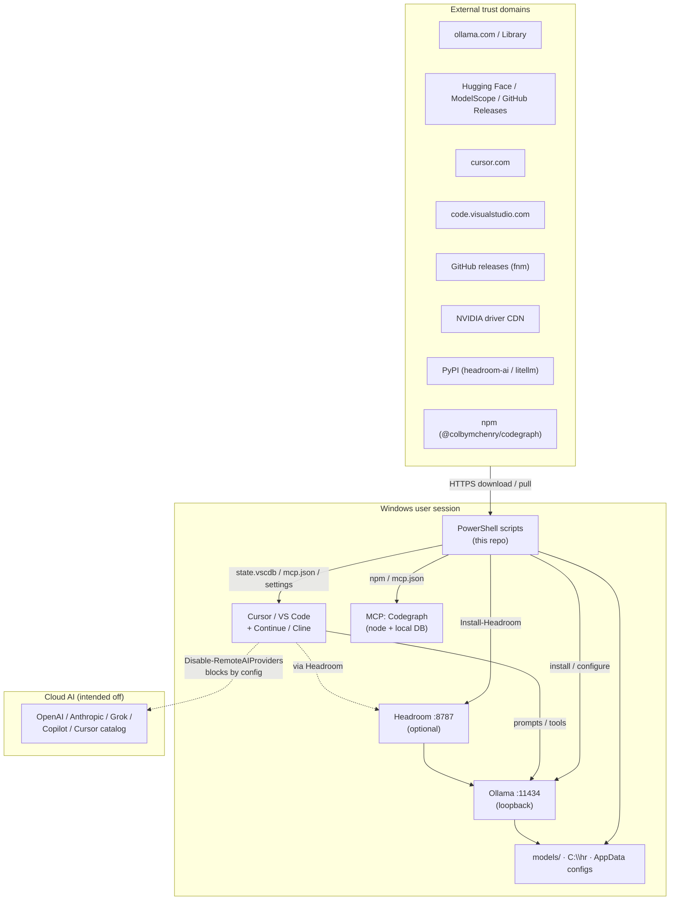
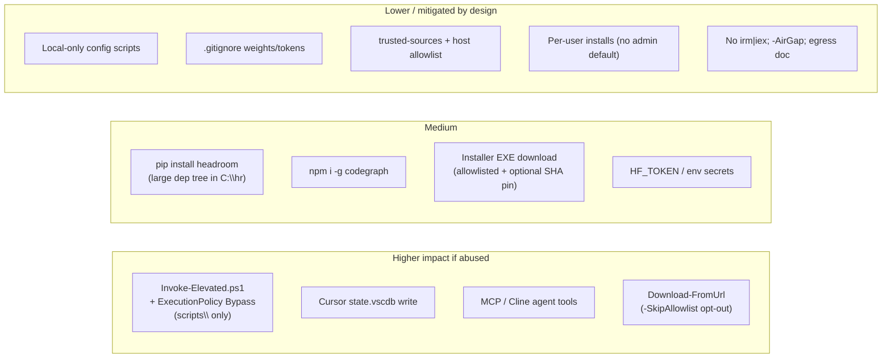
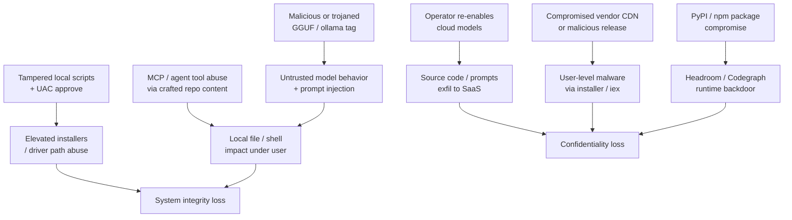

# Infosec analysis & SWOT — local-llm-chat

**Scope:** This repository (PowerShell install/config toolkit for local Ollama + editor wiring on Windows).  
**Not in scope:** Hardening of Ollama/Cursor/VS Code/Continue/Cline/Headroom upstream binaries themselves (vendor risk), or enterprise MDM policy design.  
**Date:** 2026-08-14 · **Stance:** local-first, prefer no admin, config-level remote disable (not a network firewall).

---

## 1. What this repo is (security lens)

`local-llm-chat` is a **bootstrap and configuration toolkit**. It does not ship model weights or a custom AI runtime. It:

| Does | Security implication |
|------|----------------------|
| Downloads installers / CLIs (Ollama, Cursor, VS Code, fnm, NVIDIA drivers, pip/npm packages) | **Supply-chain** trust in HTTPS origins |
| Pulls or imports GGUF / Ollama tags | **Integrity / provenance** of weights |
| Writes user editor state (`state.vscdb`, Continue/Cline configs, `settings.json`, MCP JSON) | **Integrity of IDE AI routing** |
| Optionally elevates (GPU drivers, Codegraph permissions helper) | **Privilege escalation surface** (UAC-gated) |
| Starts local proxies (Headroom → Ollama) | **Local network / process** exposure |
| Encourages agent tools (Cline, Cursor Agent, Codegraph MCP) | **Prompt-injection → tool abuse** if remotes or weak models |

---

## 2. Trust boundaries (architecture)

**Primary trust assumption:** the human operator runs scripts from a clone they control, and outbound HTTPS to documented vendors is acceptable.

---

## 3. Attack surface map

### Notable script behaviors

| Control / behavior | Location | Risk note |
|--------------------|----------|-----------|
| Download `install.ps1` then `powershell -File` (allowlisted host; optional SHA pin) | `Install-Ollama.ps1` | Safer than `irm\|iex`; still trusts ollama.com unless pin filled in `installer-pins.json` |
| HTTPS host allowlist + optional `-ExpectedSha256` | `Download-FromUrl.ps1` | Rejects random mirrors by default; `-SkipAllowlist` is operator opt-out |
| UAC elevate + `-ExecutionPolicy Bypass` (repo `scripts\` only) | `Invoke-Elevated.ps1` | Path-constrained; `-AllowOutsideRepo` required for other paths |
| Mutates Cursor SQLite state | `Install-CursorConfig.ps1` / `_Set-CursorOllamaState.cjs` | Can redirect model traffic; backups exist for some files, not a full DB restore story |
| Writes global MCP JSON | `Install-Codegraph.ps1` / `_common.ps1` | Spawns Node + Codegraph under editor; expands agent capability |
| Config-only remote disable | `Disable-RemoteAIProviders.ps1` | **Not** a firewall; see [egress-hardening.md](egress-hardening.md) |
| Loopback API checks | tests / smoke scripts | Good default; does not prove Ollama is bound only to localhost forever |

---

## 4. SWOT

### Strengths

- **Local-first product intent:** Ollama + optional `OLLAMA_NO_CLOUD`, Headroom on loopback, editors pointed at `127.0.0.1` / `localhost`.
- **Explicit remote-disable path:** `Disable-RemoteAIProviders.ps1` + checklists (`config/local-only-ai.example.md`) + tests (`Test-CursorOllama`, `Test-VSCodeSetup`, `Test-ClineSetup`).
- **Trusted-source doctrine + enforcement:** `docs/trusted-sources.md` plus HTTPS host allowlists on installer/GGUF downloads; optional SHA256 pins (`config/installer-pins.example.json`).
- **No `irm | iex`:** Ollama bootstrap downloads to disk and runs with `-File`.
- **`-AirGap` setup mode** and [egress-hardening.md](egress-hardening.md) for regulated networks.
- **Elevated scripts path-constrained** to repo `scripts\`.
- **Secret / weight hygiene in git:** `.gitignore` covers `.gguf`, tokens, `.env`, `.codegraph/`, local tool state.
- **Least privilege by default:** per-user Ollama/Cursor/VS Code/fnm/Headroom (`C:\hr`); admin only for GPU drivers / optional elevated helpers.
- **Config backups** before several Continue/settings mutations (`local-llm-chat-backups`).
- **Operational verify scripts:** status dashboard and smoke tests reduce “silently still on cloud” misconfiguration.
- **Short-path Headroom venv:** avoids broken Store-Python installs that push users toward unsafe workarounds.

### Weaknesses

- **Supply-chain residual risk:** installer SHA pins are optional (empty by default); PyPI/npm transitive deps (Headroom/litellm/transformers, Codegraph) are large and mutable.
- **`-SkipAllowlist` / `-AllowOutsideRepo` opt-outs** remain available to operators who bypass controls.
- **Remote disable is soft control:** settings/state toggles, not host firewall, AppLocker, or egress proxy; Cursor account UI and future product changes can drift.
- **High-capability local agents:** Cline/Cursor Agent + MCP can read/write files and run commands — **prompt injection** against a coding model is an infosec issue even when “local.”
- **No formal SBOM / signed releases** for this toolkit’s own scripts (integrity depends on git remote trust).
- **Token handling is documented, not enforced:** `HF_TOKEN` / `-Token` paths rely on operator discipline (gitignore helps if files are named conventionally).

### Opportunities

- Ship **filled** `installer-pins.json` for known-good Ollama/Cursor/VS Code builds (refresh on release).
- Extend allowlist + checksum to `Download-FromHuggingFace.ps1` resolve URLs when cards publish digests.
- Automate Windows Firewall profiles from [egress-hardening.md](egress-hardening.md) as an optional script.
- Add pre-commit secret scanning.
- Integrity note for GGUF: prefer HF `resolve` URLs with commit SHA; record checksums next to imports.

### Threats

| Threat | Likelihood (typical laptop) | Impact | Notes |
|--------|----------------------------|--------|-------|
| Accidental cloud re-enable / Copilot | Medium | High (IP leakage) | Soft controls only |
| Bad GGUF from non-trusted URL | Medium if users ignore docs | Medium–High | No checksum gate |
| Vendor installer compromise | Low | High | Shared industry risk |
| Prompt injection → Cline tools | Medium in agentic use | Medium–High | Local ≠ safe |
| Privilege abuse via elevated helper | Low (needs UAC) | High | Path not constrained |
| Secrets committed | Low (gitignore) | High | Naming bypasses possible |

---

## 5. Control coverage vs common goals

| Goal | Current coverage | Gap |
|------|------------------|-----|
| Keep coding prompts/code off SaaS LLMs | Strong *intent* + config scripts + tests | Not enforceable against determined user or product updates |
| Avoid untrusted model mirrors | Documented + HTTPS allowlist on `Download-FromUrl` | `-SkipAllowlist` / empty SHA pins still possible |
| Minimize admin | Strong default; elevate constrained to `scripts\` | GPU path still elevates; `-AllowOutsideRepo` opt-out |
| Protect secrets in git | Strong `.gitignore` | No pre-commit secret scanner in-repo |
| Supply-chain for runtimes | Official HTTPS + allowlist + optional pins | Pins empty until operator fills them |
| Local API exposure | Scripts assume loopback | No continuous bind-address audit |
| Agent tool safety | Out of band (user judgment) | No deny-list / sandbox for Cline |
| Offline / regulated egress | `-AirGap` + [egress-hardening.md](egress-hardening.md) | Firewall rules not auto-applied |

---

## 6. Recommended hardening backlog (priority)

1. **P0 — Document operator threat model** (this file) and link from README — **done**.
2. **P1 — Hash-verify installers**; stop raw `irm | iex` where practical — **done**.
3. **P1 — Allowlist + checksum** on `Download-FromUrl.ps1` — **done**.
4. **P2 — Constrain `Invoke-Elevated.ps1`** to `scripts\*.ps1` under the repo root — **done**.
5. **P2 — Optional “air-gap” switch** on setup — **done**.
6. **P3 — Egress guidance** (firewall / proxy) for regulated environments — **done** ([egress-hardening.md](egress-hardening.md)).
7. **P3 — Dependabot/renovate or lockfiles** — **done** (`.github/dependabot.yml` for GitHub Actions; installer pins via `config/installer-pins.example.json`; Headroom/Codegraph remain machine-global installs documented there).

---

## 7. Residual risk statement

For a **developer workstation** that already trusts Microsoft Store / vendor HTTPS and runs IDE agents, this toolkit **improves** confidentiality posture versus default cloud Copilot/Cursor catalog use, provided operators follow `trusted-sources.md` and keep `Disable-RemoteAIProviders` green.

It does **not** provide:

- Guaranteed air-gapping  
- Malware-resistant supply chain  
- Protection against malicious or jailbroken *local* models with tool access  
- Compliance certification (SOC2, FedRAMP, etc.)

Treat **local agentic coding** as still “code execution under the interactive user,” with models as an untrusted input channel.

---

## 8. Related docs

| Doc | Role |
|-----|------|
| [trusted-sources.md](trusted-sources.md) | Allowed download origins |
| [egress-hardening.md](egress-hardening.md) | Firewall / proxy / air-gap egress |
| [local-only-ai.example.md](../config/local-only-ai.example.md) | Remote-disable checklist |
| [installer-pins.example.json](../config/installer-pins.example.json) | Optional SHA256 pins |
| [integrations.md](integrations.md) | Editor / Headroom / Codegraph wiring |
| [powershell-admin-examples.md](powershell-admin-examples.md) | When UAC is actually needed |
| [AGENTS.md](../AGENTS.md) | Agent rules: no secrets/weights in git |
